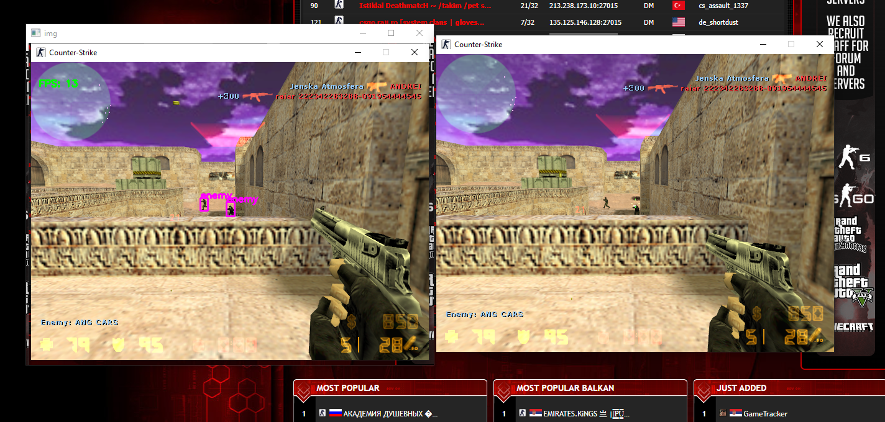
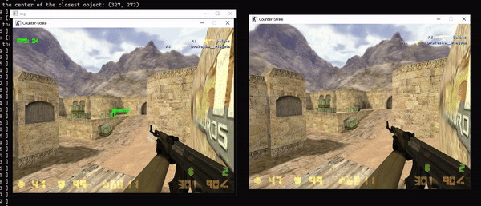

## Prerequisites

1. **Python 3.11.x**: Ensure Python 3.11.x is installed on your system.
2. **CUDA 11.8**: Ensure CUDA 11.8 is installed for GPU support.

## Setup Instructions

1. **Open Command Prompt**:
   - Navigate to your project directory.

2. **Run the Setup Script**:
   - Execute the setup script to install the required packages:
     ```bash
     py -3.11 setup_script.py
     ```

3. **Verify Dependencies**:
   - Ensure that the dependencies listed in `requirements.txt` are installed. The setup script will handle this for you.

4. **Prepare for Execution**:
   - Make sure Counter-Strike 1.6 is running in windowed mode before starting the aimbot.

5. **Run the Aimbot**:
   - Start the aimbot by running the main script:
     ```bash
     py -3.11 main.py
     ```

## Additional Notes

- The `trained.pt` file is a pre-trained YOLOv5 model used for object detection.
- You can modify the parameters in `main.py` for different detection settings or behaviors.

## Troubleshooting

- If you encounter any errors during installation or execution, please ensure all dependencies are installed and that you have the correct versions of Python and CUDA.

For further assistance, please refer to the project's documentation or contact the developer.
